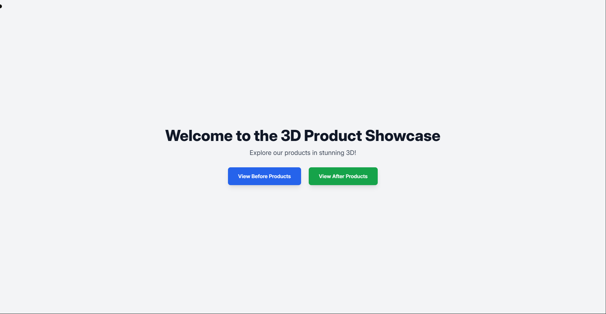
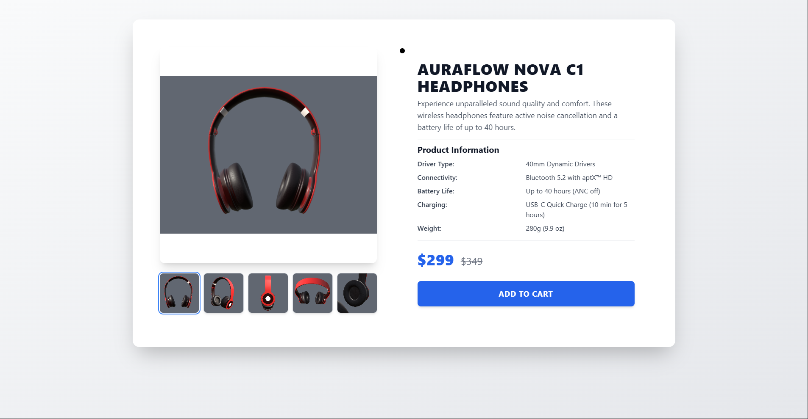
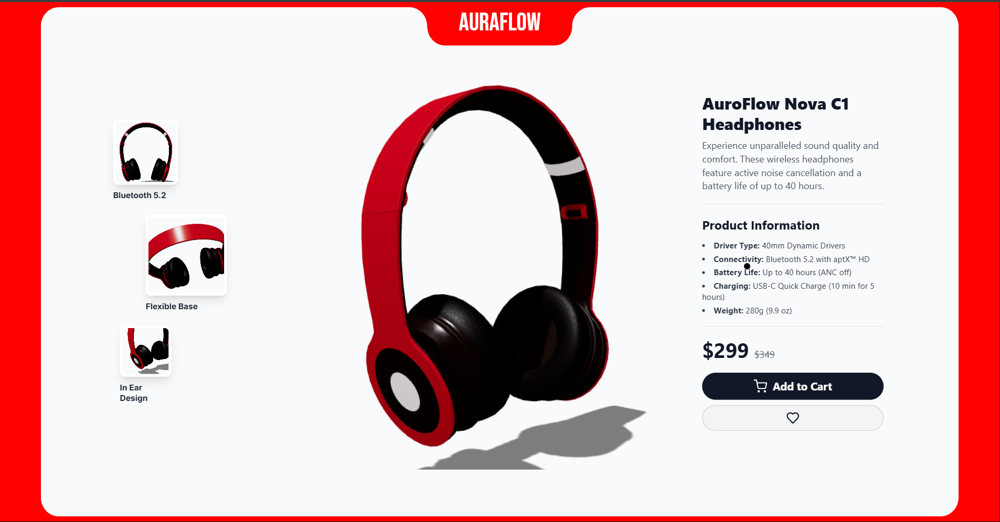

# Product Detail page

## OverView

This is just a practice demo page, It shows a comparison between outdated static pages and a modern 3d immersive design of a product details page, both pages shows the same features with the modern one offereing more space and being minimal. 

### Important Note: 
This is just a demo, things are not perfect and not responsive either, Which doesnt imply it cannot be, there is also more room for improvement and details to focus. 


## Insight 
here is a view of the first home page you will incounter, 
you can use the buttons to naviagate to the after and before pages, 

* Home Page 

* Before Page 

* After Page 



## How to set up and run it

These steps are for windows and if you are using Mac or linux, I suppose you are smart enough to copy the steps to chatGpt or whatever AI to get relevent steps for your operating system. 

### Prerequesties
Ensure you have the following Installed:

 * **Node:** Node.js Official Website (LTS version recommended)
    
    **Verify Installation:**

    ```bash
    $ node -v
    $ npm -v
    ```

### Step 1:
Click on the green code button on the top of this page and click download as Zip.Once the download is complete, Extract the zip file.

### Step 2:
* Either open the extracted folder in Vs code and run the following in terminal 
    ```bash
    npm i
    ```

* Or open powershell in the extracted folder and run the following command

    ```bash
    npm i 
    ```

### Step 3:
Once the installation completes, run the following command
```bash
npm start
```
Browser should open up automatically but you can visit it manually by typing http://localhost:3000/ in browser.


## 🎨 Contribution or Contact Me

* **I will be happy if you do** 
Contact me using the details below if you need any help at any step, Or if you need any service from my skills on your project or your site, I am Available for work

*  **For brotherly Developers (and sisterly too)** 
Feel free to show your skills on my repo by forking it and creating a pull request, You may start an issue in issue panel for any issue you incounter, You can also contact me using details below for any reason, even for no reason 😉

### **Contact info**
    * Phone number: +92 319 7877750 (I prefer whatsaap message over calls)
    * Email: mibrahimpro.1@gmail.com
    * Portfolio: [m-ibrahimdev.netlify.app](https://m-ibrahimdev.netlify.app/)


Enjoy your life to the fullest, Never let your future self blame you for wasting time and not being part of the moment and not enjoying it .....